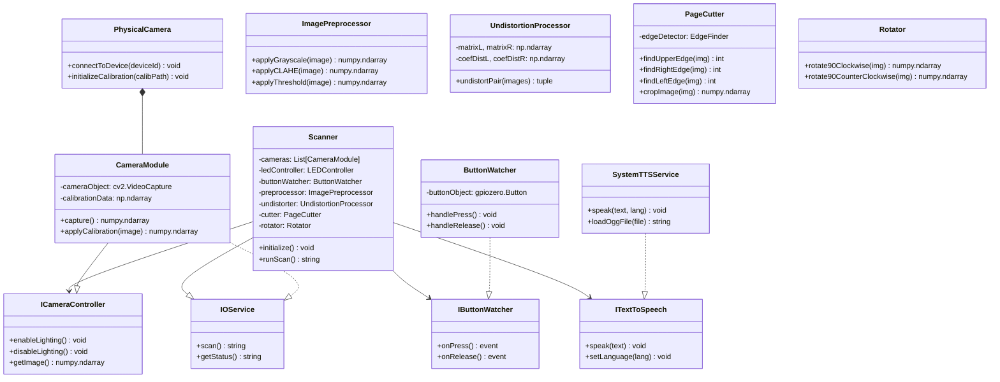

# Reading_book_scanner

# Description

Правила организации кода в репозитории:
 - SOLID
 - DRY
 - KISS
 - NOCOMMENTS

[Блок-схема](docs/SCHEMA.canvas)

# Installation

```shell
sudo apt-get update
sudo apt-get ugrade -y

pip install -r requirements.txt
```

This is the place for the code for my project of the book scanner capable to perform OCR of the scanned book pages and then read the text of the scanned book pages.
  
The project name is: CHIKS (ЧИКС = Читающий Книжный Сканер)
With its first release CHIKS supports reading paper books in Russian only.
With future releases supported languages list will be extended. 
Hardware: Raspberry PI 5 based.
Software installed:
1. operating system    Debian GNU/Linux 12 (bookworm)
2. kernel              Linux 6.12.25+rpt-rpi-2712
3. architecture        arm64  
4. OCR                 tesseract v.5.3.0
5. TTS                 RHVoice

---

# 📚 Talking Scanner CHIKS (ЧИКС) - Архитектура системы

## 🎯 Обзор архитектуры

**Talking Scanner CHIKS** — система сканирования двухсторонних страниц книг, построенная по принципу **абстракций и SOLID**. Каждый компонент реализует свой абстрактный интерфейс и может быть заменён на альтернативную реализацию.

## 🏗️ Основные компоненты системы

### 1. 🖥️ **Scanner** — Основной класс сканера
**Назначение:** Агрегирование оборудования, координация работы компонентов сканирования.

**Абстракция:** Конкретный класс, объединяющий:
- Драйверы камер
- Управление освещением
- Обработку изображений
- Мониторинг событий
- Озвучку результатов

**Интерфейсы/Связи**:
- `IOService` — получение результата сканирования
- `ITextToSpeech` — озвучка текста
- `IButtonWatcher` — мониторинг кнопок
- `ICameraController` — управление камерами

---

### 2. 📸 **CameraModule** — Модуль камеры
**Назначение:** Работа с одной камерой IMX219 (левая или правая).

**Абстракция:** Класс для управления камерой, который может быть:
- Физическим устройством (`PhysicalCamera`)
- Эмулятором для тестирования

**Интерфейсы/Связи**:
- `IOService` — получение изображения
- `ICameraController` — управление освещением

---

### 3. 💡 **LEDController** — Контроллер освещения
**Назначение:** Управление светодиодным освещением для камер.

**Абстракция:** Класс управления LED лампами (вкл/выкл, яркость).

**Интерфейсы/Связи**:
- `IOService` — статус включения

---

### 4. 🎮 **ButtonWatcher** — Монитор событий кнопок
**Назначение:** Наблюдение за состоянием кнопки запуска сканирования.

**Абстракция:** Класс-наблюдатель (Observer Pattern) для:
- Обнаружения нажатия кнопки
- Отслеживания отпускания кнопки

**Интерфейсы/Связи**:
- `IOService` — получение события нажатия/отпускания

---

### 5. 🎤 **TextToSpeech** — Озвучка текста (TTS)
**Назначение:** Синтез речи для озвучки обнаруженного текста.

**Абстракция:** Интерфейс `ITextToSpeech` с реализациями:
- Физический синтезатор речи (`SystemTTSService`)
- Файловый синтезатор (`.ogg`, `.mp3`)

---

### 6. 🖼️ **ImagePreprocessor** — Предобработка изображений
**Назначение:** Базовые операции предобработки (grayscale, CLAHE, threshold).

**Абстракция:** Композиция (`Decorator Pattern`), где каждое преобразование:
- `GrayscaleFilter`
- `CLAHEFilter`
- `ThresholdFilter`

---

### 7. 🔧 **UndistortionProcessor** — Коррекция дисторсии
**Назначение:** Исправление оптических искажений с помощью калибрационных матриц.

**Абстракция:** Обрабатывает изображение по формуле:
```
image_undistorted = cv.undistort(image, K_new)
```

---

### 8. ✂️ **PageCutter** — Обрезка страниц (ROI)
**Назначение:** Выделение полезной области страницы (Region of Interest).

**Абстракции:** Реализует алгоритмы поиска границ:
- `UpperEdgeFinder` — верхняя граница
- `RightEdgeFinderL/R` — правая граница для L/R
- `LeftEdgeFinderL/R` — левая граница для L/R

---

### 9. 📐 **Rotator** — Поворот изображения
**Назначение:** Корректное поворот страниц после обрезки.

**Абстракции**:
- `ClockwiseRotator(90°)` — для правой страницы
- `CounterClockwiseRotator(90°)` — для левой страницы

## 🎨 Абстрактная архитектура системы (UML)



---

## 📊 Визуальная блок-схема архитектуры

См. файл [`SCHEMA.canvas`](./docs/SCHEMA.canvas) для интерактивной диаграммы в формате JSON (совместимо с Obsidian Canvas).

В схеме отображены:
- **🏁 start_node** — инициализация системы
- **🔌 hardware_layer** — аппаратный слой (камеры, LED, кнопка)
- **📦 drivers_layer** — драйверы GPIOZero
- **📐 calibration_layer** — калибровочные данные
- **🔄 image_pipeline** — пайплайн обработки изображений
- **🔧 preprocessing** — предобработка (CLAHE)
- **🧪 undistortion** — коррекция дисторсии
- **✂️ image_processing** — обрезка и поворот
- **💾 output** — вывод результатов

---

## 🛠️ Технические детали

### Паттерны проектирования:
1. **Strategy Pattern** — выбор методов обработки изображений (grayscale, CLAHE, threshold)
2. **Decorator Pattern** — композиция фильтров для предобработки
3. **Observer Pattern** — мониторинг событий кнопок
4. **Factory Pattern** — создание камер (PhysicalCamera, VirtualCamera)

### Ссылки:
- [Mermaid диаграмма](./docs/SCHEMA.md) — альтернативный формат для Obsidian Mermaid
- [Canvas схема](./docs/SCHEMA.canvas) — JSON-диаграмма для Canvas

---

## 📂 Структура проекта (скаффолдинг)

```
/home/crank/projects/Reading_book_scanner/docs/.obsidian/
├── SCHEMA.md          # Mermaid диаграмма
└── SCHEMA.canvas      # JSON-диаграмма для Canvas
```

### Реализации компонентов (по мере разработки):
```
src/
├── scanner.py        # Основной класс Scanner
├── camera_module.py  # CameraModule
├── led_controller.py # LEDController
├── button_watcher.py # ButtonWatcher
├── text_to_speech.py # TextToSpeech
├── image_preprocessor.py # ImagePreprocessor
├── undistortion_processor.py # UndistortionProcessor
├── page_cutter.py    # PageCutter (edge detection)
└── rotator.py        # Rotator
```

### Тестовые реализации:
```
tests/
├── test_scanner.py
├── test_camera.py
├── test_button_watcher.py
└── test_tts.py
```
